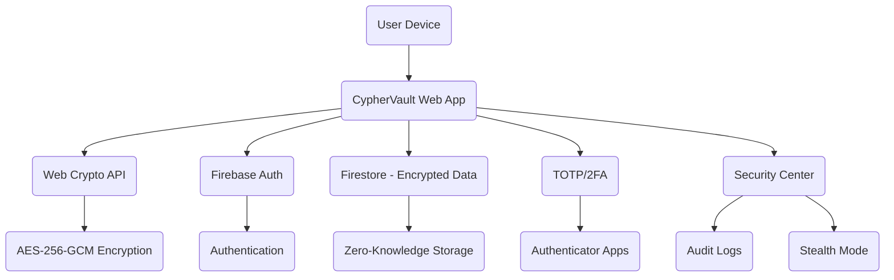

# 🛡️ CypherVault - Zero-Knowledge Secure Password Manager

<div align="center">


**A next-generation, end-to-end encrypted password manager with zero-knowledge architecture and advanced security features.**

[CYPHER VAULT APP](https://cypher-vault-project.web.app/)

</div>

---

## 📋 Table of Contents

- [Overview](#overview)
- [Key Features](#key-features)
- [Technology Stack](#technology-stack)
- [System Architecture](#system-architecture)
- [Installation Guide](#installation-guide)
- [Usage Instructions](#usage-instructions)
- [API Documentation](#api-documentation)
- [Configuration](#configuration)
- [Troubleshooting](#troubleshooting)
- [Contributing](#contributing)
- [License](#license)
- [Acknowledgments](#acknowledgments)
- [Support](#support)

---

## 🎯 Overview

CypherVault is a modern password manager designed for maximum security and privacy. Built with a zero-knowledge architecture, all encryption and decryption happen on your device—your secrets never leave your hands. CypherVault leverages strong cryptography, multi-factor authentication, and a beautiful, responsive UI to keep your digital life safe and convenient.

### 🌟 Target Users
- **Individuals**: Securely manage personal credentials
- **Teams**: Share secrets safely with advanced access controls
- **Security-Conscious Users**: For those who demand the highest standards in privacy

---

## ✨ Key Features

### 🔒 **Uncompromising Security**
- **Zero-Knowledge Encryption**: All encryption/decryption is client-side; your keys and passwords never leave your device.
- **AES-256-GCM Encryption**: Industry-standard, authenticated encryption for all secrets.
- **PBKDF2-HMAC-SHA256**: Strong key derivation with 310,000+ iterations.
- **Per-Entry Encryption**: Each password entry is uniquely encrypted with its own salt and IV.
- **Secure Storage**: All sensitive data is encrypted before being stored in Firebase.

### 🛡️ **Advanced Protections**
- **Content Security Policy (CSP)**: Strict CSP headers block inline scripts and restrict content to trusted sources.
- **Two-Factor Authentication (2FA)**: TOTP-based 2FA for robust account protection.
- **Automatic Vault Locking**: Auto-locks after inactivity to prevent unauthorized access.
- **Reauthentication for Sensitive Actions**: Password verification required for critical operations.
- **Memory Sanitization**: Sensitive data is wiped from memory when not needed.
- **Password Strength Meter**: Real-time feedback using zxcvbn entropy analysis.
- **Security Audit Logs**: Track all security events with searchable history.

### 🏆 **Elite Security (Tier 3)**
- **WebAuthn/FIDO2**: Hardware-backed, phishing-resistant authentication.
- **Clipboard Auto-Clear**: Sensitive data is cleared from clipboard after a timeout.
- **Stealth Mode & Panic Key**: Instantly hide sensitive info and lock vault with a panic keystroke.
- **Session Integrity Verification**: Protects against session tampering.
- **Device Fingerprinting**: Restrict access to trusted devices.
- **Decoy Vault**: Fake credentials for coercion scenarios.
- **Password Breach Checking**: Zero-knowledge checks against Have I Been Pwned.

### 🖥️ **Modern User Experience**
- **Responsive Web UI**: Works beautifully on desktop and mobile
- **Dark/Light Mode**: Seamless theme switching
- **Password Generator**: Create strong, unique passwords
- **Secure Sharing**: Share credentials safely
- **Comprehensive Security Center**: All your security controls in one place

---

## 🛠️ Technology Stack

### **Frontend**
- **React 18**: Modern UI framework
- **TypeScript**: Type-safe development
- **Tailwind CSS**: Utility-first styling

### **Backend & Cloud**
- **Firebase**: Authentication, Firestore, Hosting
- **Web Crypto API**: Client-side cryptography

### **Security & Utilities**
- **zxcvbn**: Password strength estimation
- **TOTP**: Two-factor authentication
- **Have I Been Pwned API**: Breach checking

---

## 🏗️ System Architecture



---

## 🚀 Installation Guide

### 1. **Clone the Repository**

```bash
git clone https://github.com/aadii-chavan/CypherVault.git
cd CypherVault
```

### 2. **Setup Environment Variables**

Copy the example environment file and update with your Firebase config:

```bash
cp .env.example .env
```

Edit `.env` with your Firebase project settings.

### 3. **Install Dependencies**

```bash
npm install
# or
yarn install
```

### 4. **Start the Development Server**

```bash
npm run dev
# or
yarn dev
```

The app will be available at `http://localhost:5173` (default).

---

## 📝 Usage Instructions

1. **Sign Up / Log In**: Create an account or log in with your credentials.
2. **Set Your Password**: Your vault key is derived from your account password.
3. **Add Passwords**: Store, edit, and organize your credentials securely.
4. **Enable 2FA**: Add an extra layer of security with TOTP.
5. **Use Security Center**: Monitor audit logs, check for breaches, and manage trusted devices.
6. **Lock/Unlock Vault**: Vault auto-locks after inactivity; unlock with your password.

---

## 🔌 API Documentation

CypherVault is primarily a client-side app, but exposes limited API endpoints for advanced features.

### **Base URL**
```
https://cypher-vault-project.web.app/api
```

### **Endpoints**

#### **POST /api/check-password**
Check password strength and breach status.

#### **POST /api/rate-limit**
Rate limiting for sensitive operations.

---

## ⚙️ Configuration

- All configuration is managed via `.env` and Firebase Console.
- Update `.env` for custom settings (see `.env.example`).

Example `.env`:
```env
VITE_FIREBASE_API_KEY=your_api_key
VITE_FIREBASE_AUTH_DOMAIN=your_auth_domain
VITE_FIREBASE_PROJECT_ID=your_project_id
VITE_FIREBASE_STORAGE_BUCKET=your_storage_bucket
VITE_FIREBASE_MESSAGING_SENDER_ID=your_sender_id
VITE_FIREBASE_APP_ID=your_app_id
```

---

## 🧰 Troubleshooting

### Common Issues

- **Login Problems**: Check Firebase config and internet connection.
- **Vault Not Unlocking**: Ensure correct password; reset if forgotten.
- **2FA Issues**: Sync device time; re-scan QR if needed.
- **Deployment Errors**: Check Firebase CLI and permissions.

### Debugging

- Use browser dev tools for client-side errors.
- Check Firebase Console for backend/auth issues.

---

## 🤝 Contributing

We welcome contributions! Please fork the repo, create a feature branch, and submit a pull request. See [CONTRIBUTING.md](CONTRIBUTING.md) for details.

---

## 📄 License

This project is licensed under the MIT License - see the [LICENSE](LICENSE) file for details.

---

## 🙏 Acknowledgments

- **Firebase Team**: For secure backend infrastructure
- **React Community**: For the robust UI framework
- **OWASP**: For security best practices
- **zxcvbn**: For password strength estimation
- **Have I Been Pwned**: For breach checking API

---

## 📞 Support

For support, questions, or feature requests:
- **GitHub Issues**: [Create an issue](https://github.com/aadii-chavan/CypherVault/issues)
- **Documentation**: Check this README and inline code comments
- **Community**: Join discussions in the GitHub repository

---

<div align="center">

**CypherVault - Your Security, Your Control**

*Protect your digital life with confidence.*

[](https://github.com/aadii-chavan/CypherVault)
[](https://github.com/aadii-chavan/CypherVault/fork)

</div>
